# Proyecto Final PPW — Academic Events API

API REST desarrollada con Spring Boot 4, Java 21, PostgreSQL, Redis, Flyway y Spring Security con JWT, orientada a la gestión integral de eventos académicos, sesiones, inscripciones, control de roles, generación de reportes, certificados y auditoría.

### Estudiantes
* Sebastián Zurita
* Emanuel León

## 1.Enlaces públicos

* Repositorio GitHub:  https://github.com/TZsebastian/ppw-proyecto-final

* Backend API Base: https://academic-events-api-tpb0.onrender.com

* Swagger UI: https://academic-events-api-tpb0.onrender.com/swagger-ui/index.html

* Actuator Health Check: https://academic-events-api-tpb0.onrender.com/actuator/health

* Video de presentación: 

Credenciales de Swagger: usuario [admin]

La contraseña se entrega por separado y no se publica en el repositorio.

## 2. Descripción general

Academic Events API permite administrar eventos académicos, categorías, sesiones e inscripciones mediante una arquitectura REST segura.

El sistema incluye:

* autenticación con JWT;

* Access Token y Refresh Token;

* control de acceso por roles;

* validación de propiedad de recursos;

* rate limiting mediante Redis;

* bloqueo temporal por intentos fallidos;

* auditoría de operaciones;

* generación de reportes en PDF y Excel;

* generación de certificados de inscripción en PDF;

* documentación OpenAPI mediante Swagger;

* migraciones y datos iniciales mediante Flyway;

* despliegue mediante Docker.

## 3. Arquitectura y seguridad

### 3.1 Tecnologías principales

| Tecnología | Uso |
|---|---|
| Java 21 | Lenguaje principal |
| Spring Boot 4 | Framework backend |
| Spring Web | Creación de endpoints REST |
| Spring Data JPA | Persistencia |
| PostgreSQL | Base de datos relacional |
| Redis | Rate limiting y bloqueo temporal |
| Spring Security | Autenticación y autorización |
| JWT | Access Token y Refresh Token |
| Flyway | Migraciones de base de datos |
| OpenAPI / Swagger | Documentación de la API |
| OpenPDF | Reportes y certificados PDF |
| Apache POI | Exportación Excel |
| Docker | Empaquetado y despliegue |
| Gradle | Gestión de dependencias y construcción |

### 3.2 Autenticación

La API utiliza autenticación **Stateless JWT**.

- El Access Token tiene una duración corta.
- El Refresh Token permite renovar el acceso.
- Los Refresh Tokens se almacenan de forma segura y pueden ser revocados.
- El logout invalida el Refresh Token correspondiente.

### 3.3 Roles

El sistema utiliza los siguientes roles:

| Rol | Permisos principales |
|---|---|
| `ROLE_ADMIN` | Administración total, usuarios, categorías, estados, reportes y auditoría |
| `ROLE_ORGANIZER` | Gestión de sus propios eventos, sesiones, inscripciones y reportes |
| `ROLE_PARTICIPANT` | Consulta de eventos y gestión de sus propias inscripciones |

### 3.4 Validación de propiedad

Los organizadores únicamente pueden modificar o consultar recursos asociados a eventos de su propiedad.

Los participantes únicamente pueden consultar o cancelar sus propias inscripciones.

### 3.5 Protección adicional

- Rate limiting por IP y correo electrónico.
- Bloqueo temporal por múltiples intentos fallidos.
- Respuestas de error centralizadas mediante `@RestControllerAdvice`.
- Encabezado `Retry-After` en respuestas HTTP `429`.
- Swagger protegido con HTTP Basic en producción.
- CORS configurable mediante variables de entorno.
- Actuator limitado al endpoint de salud.

---

## 4. Modelo de base de datos y migraciones

El proyecto utiliza **Flyway** para versionar el esquema de PostgreSQL y cargar los datos iniciales.

La migración principal se encuentra en:

```text
src/main/resources/db/migration/V1__initial_schema_and_data.sql

```
## Esta migración incluye:

* creación de tablas;

* claves primarias;

* claves foráneas;

* restricciones de integridad;

* índices;

* roles iniciales;

* usuarios iniciales;

* categorías iniciales;

* datos de prueba.

## 4.1 Diagrama entidad-relación

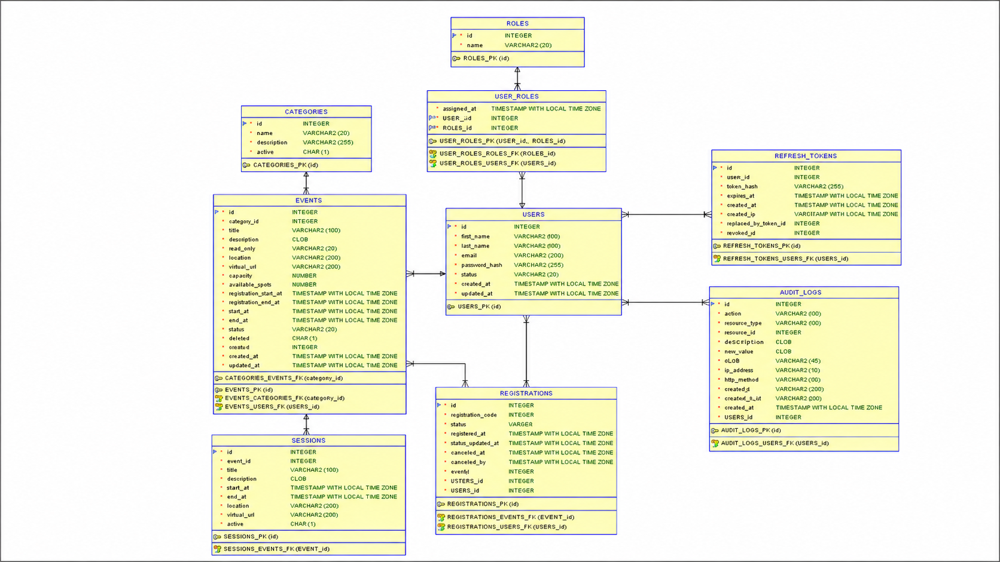

## 4.2 Tablas principales

* users

* roles

* user_roles

* categories

* events

* sessions

* registrations

* refresh_tokens

* audit_logs

## 4.3 Credenciales de prueba

Estas credenciales se insertan automáticamente mediante Flyway.

| Rol | Email | Contraseña |
|---|---|---|
| **Administrador** | `admin@academic.test` | `Admin123*` |
| **Organizador** | `maria.cordero@academic.test` | `Password123*` |
| **Participante** | `juan.participante@academic.test` | `Password123*` |

## 5.- Variables de Entorno Requeridas:

Consulta el archivo `.env.example` ubicado en la raíz del proyecto para revisar el listado completo de variables necesarias.

| Variable | Descripción | Origen / Ámbito |
|---|---|---|
| `PORT` | Puerto de escucha del servidor embebido. | Automático en Render / Localmente `8080` |
| `DB_URL` o `SPRING_DATASOURCE_URL` | Cadena JDBC de conexión a PostgreSQL, por ejemplo `jdbc:postgresql://host:port/base_datos`. | Configuración local o Render |
| `DB_USERNAME` o `SPRING_DATASOURCE_USERNAME` | Usuario utilizado para conectarse a PostgreSQL. | Variable de entorno |
| `DB_PASSWORD` o `SPRING_DATASOURCE_PASSWORD` | Contraseña utilizada para conectarse a PostgreSQL. | Variable de entorno |
| `REDIS_URL` | Cadena completa de conexión a Redis. | Servicio Redis / Render Key Value |
| `SPRING_DATA_REDIS_HOST` | Host donde se encuentra Redis. | Local o Docker |
| `SPRING_DATA_REDIS_PORT` | Puerto de conexión de Redis. | Localmente `6379` |
| `JWT_SECRET` | Clave secreta utilizada para firmar y validar los tokens JWT. Debe tener al menos 48 caracteres. | Variable de entorno segura |
| `JWT_ACCESS_EXPIRATION` | Tiempo de expiración del Access Token en milisegundos. | Valor recomendado: `900000` |
| `JWT_REFRESH_EXPIRATION` | Tiempo de expiración del Refresh Token en milisegundos. | Valor recomendado: `604800000` |
| `ALLOWED_ORIGINS` | Dominios autorizados para realizar solicitudes mediante CORS. | Configuración web |
| `SWAGGER_SECURITY_ENABLED` | Activa o desactiva la protección de Swagger mediante HTTP Basic. | `true` en producción / `false` localmente |
| `SWAGGER_USER` | Usuario utilizado para acceder a Swagger UI cuando la protección está activa. | Seguridad Basic Auth |
| `SWAGGER_PASSWORD` | Contraseña utilizada para acceder a Swagger UI. | Entregada por separado |
| `FLYWAY_BASELINE_ON_MIGRATE` | Permite crear una línea base de Flyway cuando se utiliza una base de datos existente con tablas creadas previamente. | `false` para bases nuevas / `true` únicamente cuando sea necesario |

### 5.1.- Archivo `.env.example`

El archivo `.env.example` debe ubicarse en la raíz del proyecto y servir como referencia para configurar las variables requeridas.

```env
PORT=8080

DB_URL=jdbc:postgresql://localhost:5432/devdb
DB_USERNAME=ups
DB_PASSWORD=CAMBIAR

REDIS_URL=redis://localhost:6379

JWT_SECRET=CAMBIAR_POR_UNA_CLAVE_SEGURA_DE_AL_MENOS_48_CARACTERES
JWT_ACCESS_EXPIRATION=900000
JWT_REFRESH_EXPIRATION=604800000

ALLOWED_ORIGINS=http://localhost:5173

SWAGGER_SECURITY_ENABLED=false
SWAGGER_USER=evaluador
SWAGGER_PASSWORD=CAMBIAR

FLYWAY_BASELINE_ON_MIGRATE=false

```

## 6.- Ejecución en Entorno Local

### 6.1.- Requisitos previos

Antes de ejecutar el proyecto se requiere tener instaladas las siguientes herramientas:

- Java 21
- Docker Desktop
- Docker Compose
- PostgreSQL 16 o superior
- Redis
- Git

### 6.2.- Clonar el repositorio

```bash
git clone [INSERTAR URL DEL REPOSITORIO]
cd academic-events
```

### 6.3.- Configurar variables de entorno

En Linux o macOS:

```bash
cp .env.example .env
```

En Windows PowerShell:

```powershell
Copy-Item .env.example .env
```

Después, completar los valores correspondientes sin publicar secretos reales.

### 6.4.- Levantar PostgreSQL y Redis

Cuando exista un archivo `docker-compose.yml`, ejecutar:

```bash
docker compose up -d
```

Verificar que los servicios estén activos:

```bash
docker ps
```

Deben aparecer al menos los servicios de PostgreSQL y Redis.

### 6.5.- Ejecutar la aplicación con Gradle

En Windows:

```powershell
.\gradlew.bat bootRun
```

En Linux o macOS:

```bash
./gradlew bootRun
```

La API estará disponible en:

```text
http://localhost:8080/api
```

Swagger estará disponible en:

```text
http://localhost:8080/swagger-ui/index.html
```

Actuator Health estará disponible en:

```text
http://localhost:8080/actuator/health
```

---

## 87- Ejecución con Docker

### 7.1.- Construir la imagen

Desde la raíz del proyecto:

```bash
docker build -t academic-events-api .
```

### 7.2.- Ejecutar el contenedor

Ejemplo para Windows PowerShell:

```powershell
docker run --name academic-events-api `
  --network academic-network `
  -p 8080:8080 `
  -e PORT=8080 `
  -e SPRING_DATASOURCE_URL="jdbc:postgresql://postgres-dev:5432/devdb" `
  -e SPRING_DATASOURCE_USERNAME="ups" `
  -e SPRING_DATASOURCE_PASSWORD="[CONTRASEÑA LOCAL]" `
  -e SPRING_DATA_REDIS_HOST="redis-dev" `
  -e SPRING_DATA_REDIS_PORT="6379" `
  -e JWT_SECRET="[CLAVE JWT SEGURA]" `
  -e SWAGGER_SECURITY_ENABLED="false" `
  academic-events-api
```

> No se deben publicar contraseñas reales ni el valor completo de `JWT_SECRET`.

### 7.3.- Verificar el contenedor

Comprobar que el contenedor esté ejecutándose:

```bash
docker ps
```

Verificar el estado de la aplicación:

```bash
curl http://localhost:8080/actuator/health
```

Respuesta esperada:

```json
{
  "groups": [
    "liveness",
    "readiness"
  ],
  "status": "UP"
}
```

---

## 8.- Endpoints Principales

### 8.1.- Autenticación

| Método | Endpoint | Descripción |
|---|---|---|
| `POST` | `/api/auth/login` | Iniciar sesión |
| `POST` | `/api/auth/register` | Registrar un nuevo participante |
| `POST` | `/api/auth/refresh` | Renovar el Access Token |
| `POST` | `/api/auth/logout` | Revocar el Refresh Token |
| `GET` | `/api/auth/me` | Consultar el usuario autenticado |

### 8.2.- Usuarios y categorías

| Método | Endpoint | Descripción |
|---|---|---|
| `GET` | `/api/users` | Listar usuarios |
| `POST` | `/api/users` | Crear un nuevo usuario |
| `PUT` | `/api/users/{id}` | Actualizar un usuario |
| `DELETE` | `/api/users/{id}` | Desactivar o eliminar un usuario |
| `GET` | `/api/categories` | Listar categorías |
| `POST` | `/api/categories` | Crear una nueva categoría |
| `PUT` | `/api/categories/{id}` | Actualizar una categoría |
| `PATCH` | `/api/categories/{id}` | Cambiar parcialmente una categoría |
| `DELETE` | `/api/categories/{id}` | Eliminar o desactivar una categoría |

### 8.3.- Eventos y sesiones

| Método | Endpoint | Descripción |
|---|---|---|
| `GET` | `/api/events` | Listar eventos |
| `GET` | `/api/events/{id}` | Consultar un evento por identificador |
| `GET` | `/api/events/mine` | Listar eventos del organizador autenticado |
| `POST` | `/api/events` | Crear un nuevo evento |
| `PUT` | `/api/events/{id}` | Actualizar un evento propio |
| `PATCH` | `/api/events/{id}` | Actualizar parcialmente un evento propio |
| `DELETE` | `/api/events/{id}` | Eliminar un evento propio |
| `GET` | `/api/events/{id}/sessions` | Listar sesiones de un evento |
| `POST` | `/api/events/{id}/sessions` | Crear una sesión |
| `PUT` | `/api/events/{id}/sessions/{sessionId}` | Actualizar una sesión |
| `DELETE` | `/api/events/{id}/sessions/{sessionId}` | Eliminar una sesión |

### 8.4.- Inscripciones

| Método | Endpoint | Descripción |
|---|---|---|
| `POST` | `/api/events/{eventId}/registrations` | Crear una inscripción |
| `GET` | `/api/events/{eventId}/registrations` | Consultar inscripciones de un evento |
| `GET` | `/api/registrations/mine` | Consultar inscripciones del participante autenticado |
| `PATCH` | `/api/registrations/{id}/confirm` | Confirmar una inscripción |
| `PATCH` | `/api/registrations/{id}/reject` | Rechazar una inscripción |
| `PATCH` | `/api/registrations/{id}/cancel` | Cancelar una inscripción propia |

### 8.5.- Reportes y certificados

| Método | Endpoint | Descripción |
|---|---|---|
| `GET` | `/api/reports/events/{eventId}/registrations/pdf` | Descargar reporte de inscripciones en PDF |
| `GET` | `/api/reports/events/{eventId}/registrations/excel` | Descargar reporte de inscripciones en Excel |
| `GET` | `/api/reports/registrations/{registrationId}/certificate` | Descargar certificado de inscripción en PDF |

## 9.- Pruebas y Verificaciones

### 9.1.- Ejecución de Pruebas Automatizadas

Para ejecutar todas las pruebas del proyecto:

En Windows:

```powershell
.\gradlew.bat clean test
```

En Linux o macOS:

```bash
./gradlew clean test
```

Resultado esperado:

```text
BUILD SUCCESSFUL
```

### 10.2.- Evidencias de Pruebas

- Ejecución exitosa de las pruebas automatizadas:

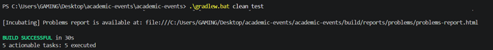

- Reporte HTML generado por Gradle:

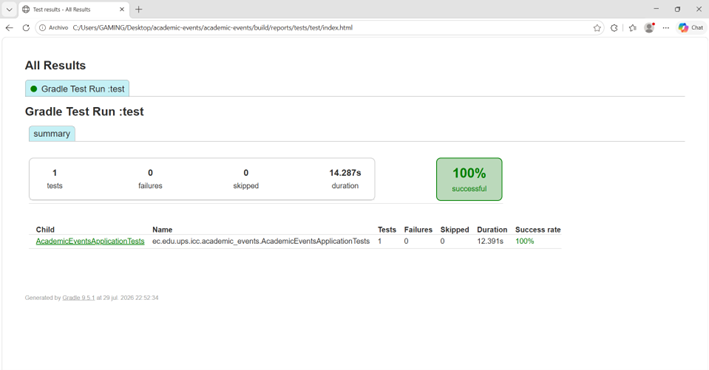

El reporte completo se genera en:

```text
build/reports/tests/test/index.html
```

## Pruebas Swagger
- Swagger UI desplegado en Render:

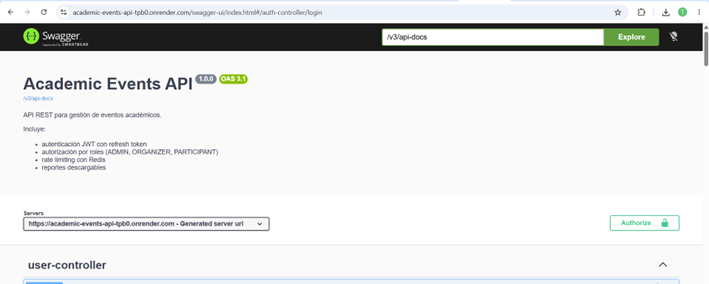

- Pruebas de autenticación:

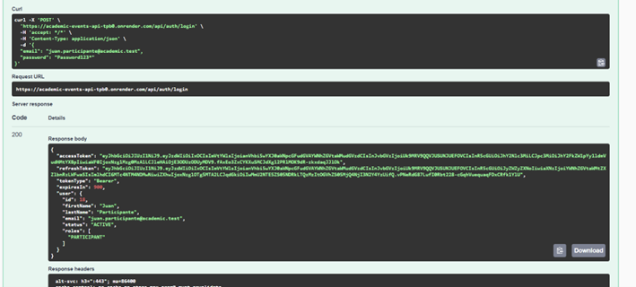

- Pruebas de autorización y roles:

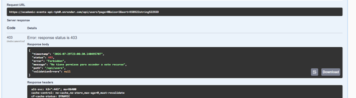

- Pruebas de eventos:

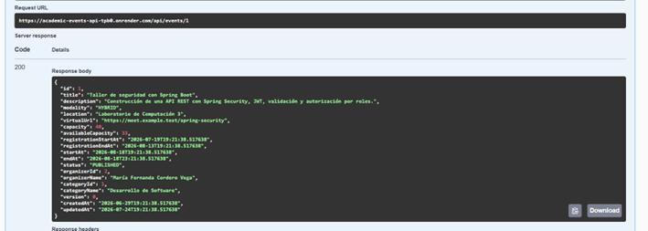

- Pruebas de inscripciones:

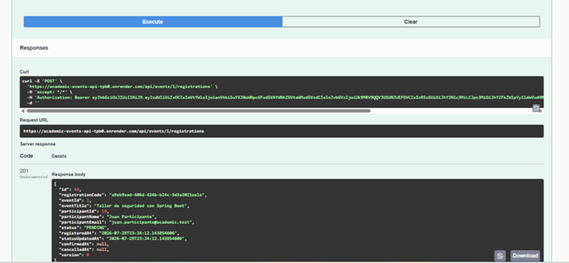

- Pruebas de reportes y certificados:

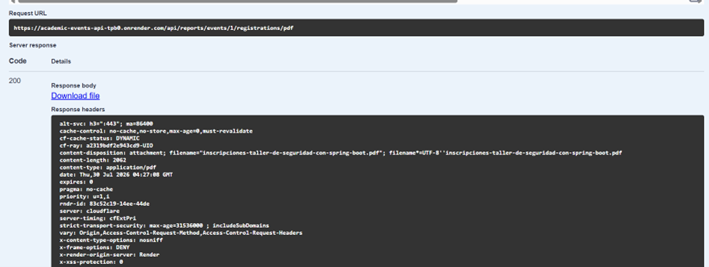


- Prueba de Rate Limiting en el inicio de sesión:

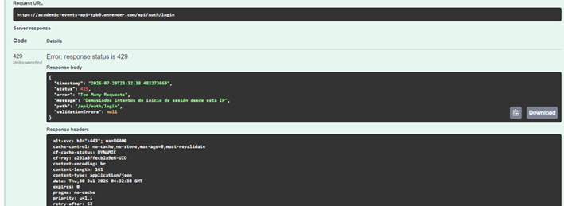

- Manejo de errores con recurso inexistente

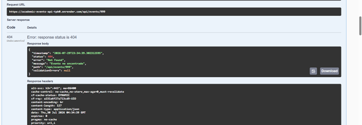

- Actuator Health en producción

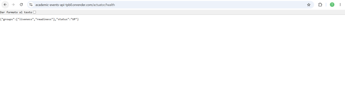

